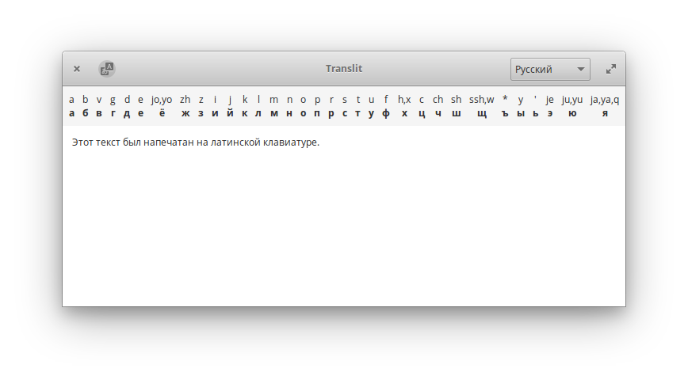

  <h1 align="center">Translit</h1>
  <h3 align="center">Translit is a method of encoding Cyrillic letters with Latin ones</h3>
  
Designed for <a href="https://elementary.io"> elementary OS

  

  

## Donations
If you liked _Translit_, and would like to support it's development of this app and more, consider [buying me a coffee](https://www.paypal.me/ArtemAnufrij) :)
